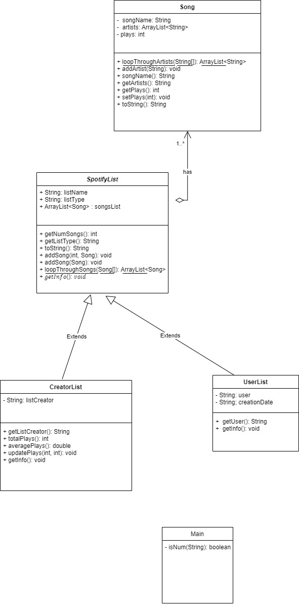

# Anujan OOP Assignment

## Summary

This class structure models the relationship between songs, user playlists and albums/singles. Songs are described in the song class, which have properties like its artists, the name of the song, and the number of times it has been listened to. SpotifyLists have an aggregate relationship with songs. A SpotifyList is an abstract class of a list of songs in the Spotify application. This class has properties like list name, list type, and a list of songs, while also having an abstract method called getInfo. The SpotifyList class is extanded by the UserList and CreatorList classes. UserList is a playlist created by a user of Spotify. This class has user and creation date properties. The CreatorList class models lists of songs added by artistts, like singles, EPs and albums. This class has a creator property, while also having unique methods, like getting the average number of plays of the songs on the list, and updating the plays on the song objects in the list. 